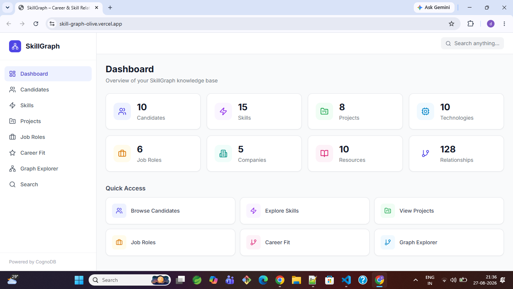
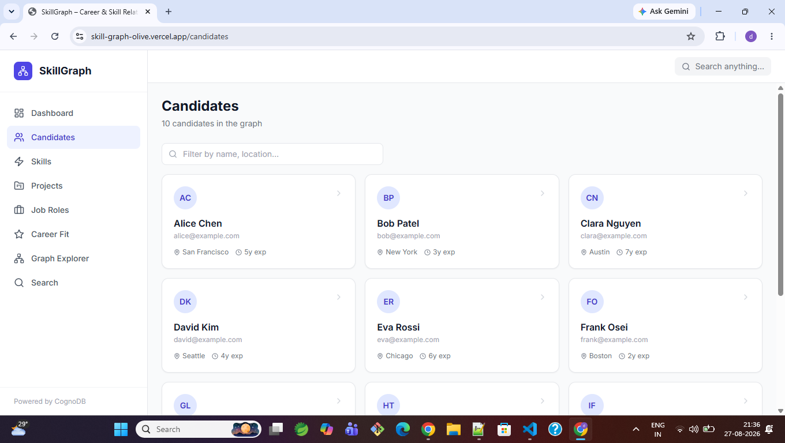
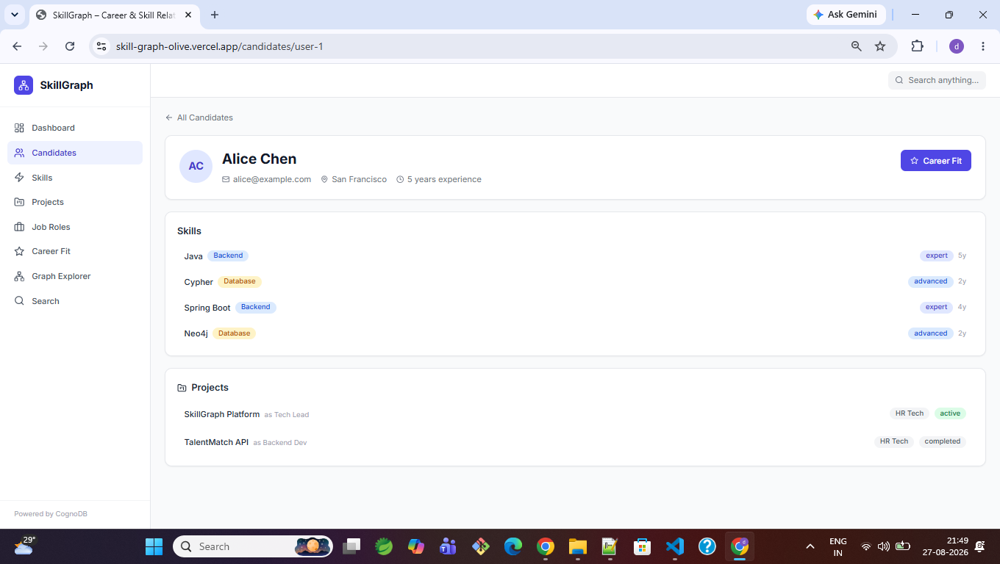
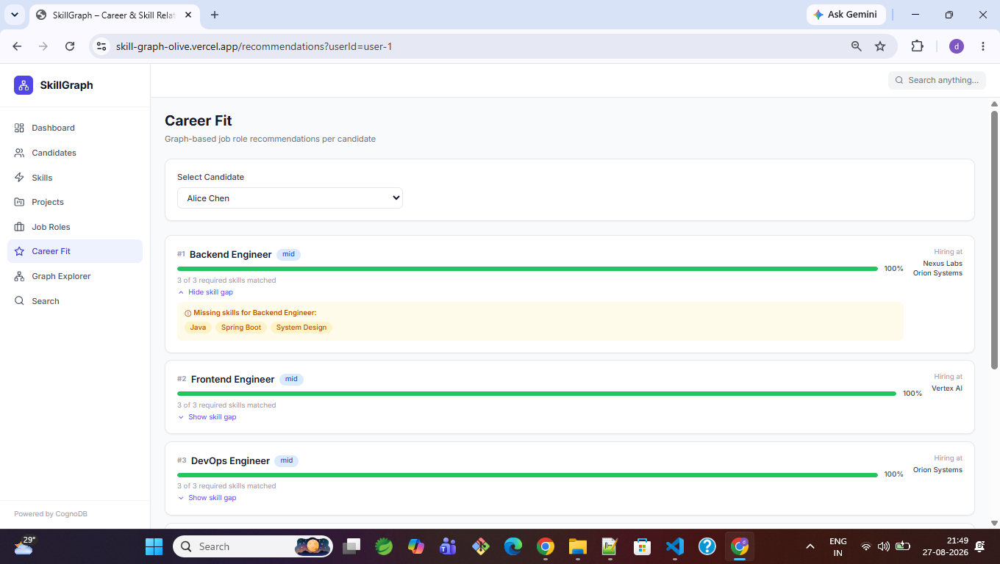
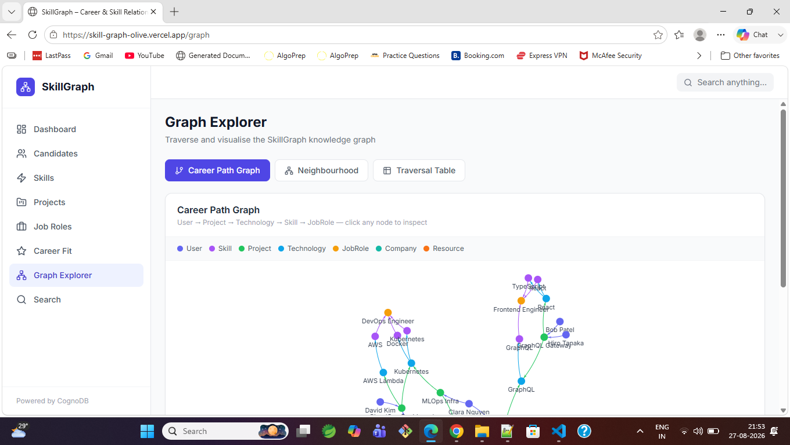
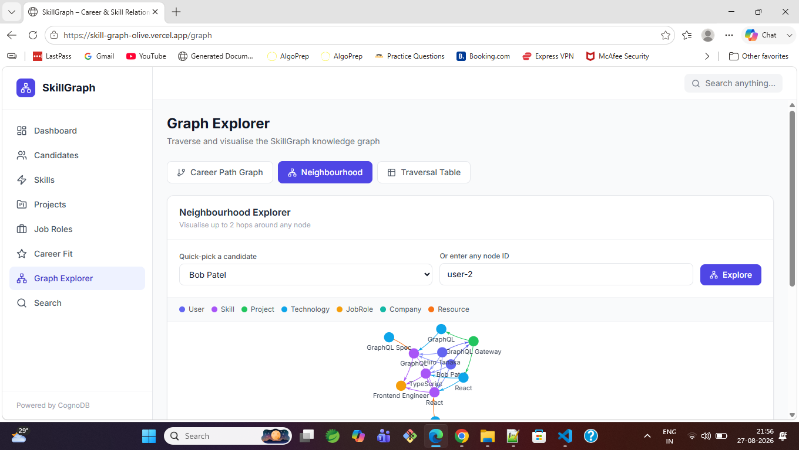
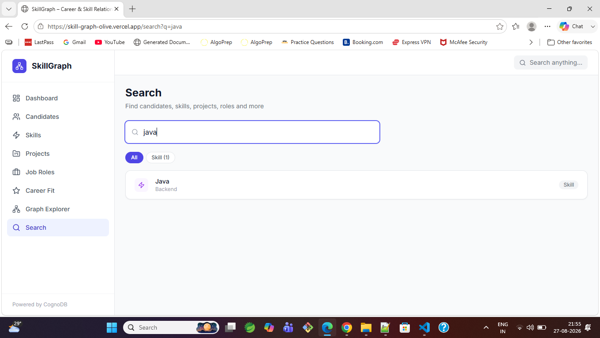

# SkillGraph

> Intelligent Skill, Project and Career Relationship Explorer — powered by **CognoDB** graph database.

SkillGraph models candidates, skills, projects, technologies, job roles, companies, and learning resources as a **property graph**. It uses graph traversal to answer questions that are relationally awkward in SQL — such as "which job roles best match this candidate's skill set, and what skills are they missing?"

---

## 🔗 Live Demo

| | URL |
|---|---|
| **Frontend** | https://skill-graph-olive.vercel.app |
| **Backend API** | https://skillgraph-3o0r.onrender.com |
| **Health Check** | https://skillgraph-3o0r.onrender.com/api/health |
| **GitHub Repo** | https://github.com/123Deepaksaini/SkillGraph |

---

## Table of Contents

1. [Project Overview](#project-overview)
2. [Why Graph Database?](#why-graph-database)
3. [Architecture](#architecture)
4. [Graph Data Model](#graph-data-model)
5. [Key Cypher Queries](#key-cypher-queries)
6. [Tech Stack](#tech-stack)
7. [Prerequisites](#prerequisites)
8. [CognoDB Setup](#cognodb-setup)
9. [Local Setup & Running](#local-setup--running)
10. [Environment Variables](#environment-variables)
11. [Seed Instructions](#seed-instructions)
12. [API Documentation](#api-documentation)
13. [Screenshots](#screenshots)
14. [Deployment](#deployment)

---

## Project Overview

SkillGraph is a full-stack web application that uses a **graph database (CognoDB)** to model and explore relationships between:

- **Candidates** — their skills, experience, and projects
- **Skills** — categories, related skills, required for roles
- **Projects** — technologies used, contributors
- **Technologies** — skills they require
- **Job Roles** — required skills, hiring companies
- **Companies** — industry, size
- **Resources** — learning materials for skills

Key features:
- Graph-based **job role recommendations** with match percentage
- **Skill-gap analysis** — what skills a candidate is missing for a role
- **Interactive force-directed graph** visualisation (Career Path + Neighbourhood Explorer)
- **4-hop multi-hop traversal**: User → Project → Technology → Skill → JobRole
- Full-text **search** across all entity types
- **Dashboard** with live stats from CognoDB

---

## Why Graph Database?

Relational databases struggle with highly connected data. Here is why SkillGraph uses CognoDB instead of SQL:

| Question | SQL approach | Graph approach |
|---|---|---|
| Which roles match a candidate's skills? | 3 JOINs + subquery + GROUP BY | Single MATCH traversal |
| What skills is a candidate missing for a role? | LEFT JOIN + WHERE IS NULL anti-join | `NOT EXISTS { MATCH ... }` |
| 4-hop career path traversal | 4 JOINs across 5 tables | One Cypher pattern |
| 2-hop neighbourhood of any node | Recursive CTE | Variable-length MATCH |
| Skill similarity graph | Self-join on skills table | `SKILL_RELATED_TO` traversal |

Graph databases store relationships as first-class citizens. Traversing them is O(1) per hop regardless of dataset size, whereas SQL JOINs degrade as tables grow.

---

## Architecture

```
┌─────────────────────────────────────────────────────────────────┐
│              Browser — https://skill-graph-olive.vercel.app     │
│                                                                 │
│   React 18 + Vite + Tailwind CSS + react-force-graph-2d        │
│   ┌──────────┐ ┌──────────┐ ┌──────────┐ ┌──────────────────┐  │
│   │Dashboard │ │Candidates│ │  Skills  │ │  Graph Explorer  │  │
│   └──────────┘ └──────────┘ └──────────┘ └──────────────────┘  │
│   ┌──────────┐ ┌──────────┐ ┌──────────┐ ┌──────────────────┐  │
│   │ Projects │ │  Roles   │ │Career Fit│ │     Search       │  │
│   └──────────┘ └──────────┘ └──────────┘ └──────────────────┘  │
│                        Axios HTTP client                        │
└────────────────────────────┬────────────────────────────────────┘
                             │ HTTPS /api/*
┌────────────────────────────▼────────────────────────────────────┐
│       Spring Boot 3.2 — https://skillgraph-3o0r.onrender.com   │
│                  Deployed via Docker on Render                  │
│                                                                 │
│  Controllers → Services → Repositories                          │
│  ┌──────────────────────────────────────────────────────────┐   │
│  │  Neo4j Java Driver 5.18  (bolt+s:// — TLS encrypted)    │   │
│  └──────────────────────────────────────────────────────────┘   │
└────────────────────────────┬────────────────────────────────────┘
                             │ Bolt protocol (TLS)
┌────────────────────────────▼────────────────────────────────────┐
│              CognoDB Cloud (openCypher-compatible)              │
│                                                                 │
│   7 node labels · 9 relationship types · 128 relationships      │
└─────────────────────────────────────────────────────────────────┘
```

**Design decisions:**
- No Spring Data Neo4j — all Cypher is written manually for full control.
- All queries are **parameterized** (`Map.of("param", value)`) — no string concatenation.
- Credentials are read exclusively from environment variables — nothing hardcoded.
- Backend deployed as a Docker container on Render; frontend as a static site on Vercel.

---

## Graph Data Model

```
                    ┌─────────────┐
                    │   Resource  │
                    │  (res-1…10) │
                    └──────┬──────┘
                           │ RESOURCE_TEACHES
                           ▼
┌──────────┐  USER_HAS_SKILL  ┌───────────┐  SKILL_RELATED_TO  ┌───────────┐
│   User   │ ───────────────► │   Skill   │ ──────────────────► │   Skill   │
│(user-1…10│                  │(skill-1…15│                     │  (other)  │
└────┬─────┘                  └─────┬─────┘                     └───────────┘
     │                              │ SKILL_REQUIRED_FOR
     │ USER_WORKED_ON               ▼
     │                       ┌───────────┐  ROLE_AT  ┌───────────┐
     ▼                       │  JobRole  │ ─────────► │  Company  │
┌──────────┐                 │(role-1…6) │            │(comp-1…5) │
│ Project  │                 └───────────┘            └───────────┘
│(proj-1…8)│
└────┬─────┘
     │ PROJECT_USES
     ▼
┌────────────┐  TECH_REQUIRES  ┌───────────┐
│ Technology │ ───────────────► │   Skill   │
│(tech-1…10) │                 │(skill-1…15│
└────────────┘                 └───────────┘
```

### Node Labels & Properties

| Label | Count | Key Properties |
|-------|-------|----------------|
| `User` | 10 | `id`, `name`, `email`, `yearsExp`, `location` |
| `Skill` | 15 | `id`, `name`, `category` |
| `Project` | 8 | `id`, `name`, `status`, `domain` |
| `Technology` | 10 | `id`, `name`, `type` |
| `JobRole` | 6 | `id`, `title`, `level` |
| `Company` | 5 | `id`, `name`, `industry`, `size` |
| `Resource` | 10 | `id`, `title`, `type`, `url` |

### Relationship Types

| Relationship | From → To | Properties |
|---|---|---|
| `USER_HAS_SKILL` | User → Skill | `level`, `years` |
| `USER_WORKED_ON` | User → Project | `role` |
| `PROJECT_USES` | Project → Technology | — |
| `TECH_REQUIRES` | Technology → Skill | — |
| `SKILL_RELATED_TO` | Skill → Skill | — |
| `SKILL_REQUIRED_FOR` | Skill → JobRole | — |
| `ROLE_AT` | JobRole → Company | — |
| `RESOURCE_TEACHES` | Resource → Skill | — |
| `USER_RECOMMENDED_RESOURCE` | User → Resource | — |

---

## Key Cypher Queries

### 1. Multi-hop Traversal (4 hops) — `GET /api/graph/traversal`

```cypher
MATCH (u:User)-[:USER_WORKED_ON]->(p:Project)
      -[:PROJECT_USES]->(t:Technology)
      -[:TECH_REQUIRES]->(sk:Skill)
      -[:SKILL_REQUIRED_FOR]->(r:JobRole)
RETURN u.name AS user, p.name AS project,
       t.name AS technology, sk.name AS skill, r.title AS role
LIMIT 20
```

**Why graph-native:** This 4-hop path — User → Project → Technology → Skill → JobRole — would require 4 JOINs across 5 tables in SQL. In Cypher it reads as a single pattern.

---

### 2. Graph-Based Role Recommendation — `GET /api/recommendations/{userId}`

```cypher
MATCH (u:User {id: $userId})-[:USER_HAS_SKILL]->(userSkill:Skill)
MATCH (r:JobRole)<-[:SKILL_REQUIRED_FOR]-(required:Skill)
WITH r,
     count(DISTINCT required) AS totalRequired,
     count(DISTINCT CASE WHEN (u)-[:USER_HAS_SKILL]->(required) THEN required END) AS matchedSkills
WHERE totalRequired > 0
WITH r, totalRequired, matchedSkills,
     round(100.0 * matchedSkills / totalRequired) AS matchPct
ORDER BY matchPct DESC, matchedSkills DESC
OPTIONAL MATCH (r)-[:ROLE_AT]->(c:Company)
RETURN r.id AS roleId, r.title AS roleTitle, r.level AS level,
       matchedSkills, totalRequired, matchPct,
       collect(DISTINCT {id: c.id, name: c.name, industry: c.industry}) AS companies
LIMIT 10
```

**Why relationally awkward:** Traverses two subgraphs simultaneously, computes set intersection, calculates match %, and joins companies — all in one pass. SQL needs multiple CTEs and self-joins.

---

### 3. Skill-Gap Analysis — `GET /api/recommendations/{userId}/gap/{roleId}`

```cypher
MATCH (r:JobRole {id: $roleId})<-[:SKILL_REQUIRED_FOR]-(required:Skill)
WHERE NOT EXISTS {
    MATCH (u:User {id: $userId})-[:USER_HAS_SKILL]->(required)
}
OPTIONAL MATCH (res:Resource)-[:RESOURCE_TEACHES]->(required)
RETURN required.id AS skillId, required.name AS skillName,
       required.category AS category,
       collect(DISTINCT res.title) AS resources
```

**Why graph-native:** `NOT EXISTS { MATCH ... }` checks absence of a relationship naturally. SQL requires a `LEFT JOIN ... WHERE IS NULL` anti-join.

---

### 4. Neighbourhood Exploration — `GET /api/graph/neighbourhood/{nodeId}`

```cypher
-- 1-hop
MATCH (a {id: $nodeId})-[r]-(b)
RETURN a, b, type(r) AS relType,
       startNode(r).id AS srcId, endNode(r).id AS tgtId

-- 2-hop
MATCH (a {id: $nodeId})-[]-(b)-[r2]-(c)
WHERE c.id <> $nodeId
RETURN b, c, type(r2) AS relType,
       startNode(r2).id AS srcId, endNode(r2).id AS tgtId
LIMIT 60
```

**Why graph-native:** Multi-hop neighbourhood queries have no SQL equivalent without recursive CTEs.

---

### 5. Career Path Force Graph — `GET /api/graph/career-path`

```cypher
MATCH (u:User)-[:USER_WORKED_ON]->(p:Project)
      -[:PROJECT_USES]->(t:Technology)
      -[:TECH_REQUIRES]->(sk:Skill)
      -[:SKILL_REQUIRED_FOR]->(role:JobRole)
RETURN u, p, t, sk, role,
       u.id AS uId, p.id AS pId, t.id AS tId,
       sk.id AS skId, role.id AS roleId
LIMIT 80
```

---

## Tech Stack

| Layer | Technology |
|-------|-----------|
| Database | CognoDB (openCypher-compatible graph DB) |
| DB Driver | Neo4j Java Driver 5.18.0 (official, via Bolt/TLS) |
| Backend | Spring Boot 3.2.5, Java 17 |
| Backend Deploy | Docker on Render |
| Frontend | React 18, Vite 5, Tailwind CSS 3 |
| Frontend Deploy | Vercel |
| Graph Viz | react-force-graph-2d |
| HTTP Client | Axios |
| Icons | Lucide React |

---

## Prerequisites

| Tool | Version |
|------|---------|
| Java | 17+ |
| Maven | 3.8+ |
| Node.js | 18+ |
| npm | 9+ |
| Docker | 20+ |

> **Windows:** Use `mvn17.bat` if your default Java is not 17.

---

## CognoDB Setup

1. Go to **https://cognodb.com** and create a free account
2. Create a new database instance
3. From the dashboard → your instance → **Connect**, copy:
   - **Bolt URI** → `COGNODB_URI`
   - **Username** → `COGNODB_USERNAME`
   - **Password** → `COGNODB_PASSWORD`
4. Add these to your `.env` file (see [Environment Variables](#environment-variables))

---

## Local Setup & Running

### 1. Clone the repository

```bash
git clone https://github.com/123Deepaksaini/SkillGraph.git
cd SkillGraph
```

### 2. Configure environment

Create `.env` in the project root:

```env
COGNODB_URI=bolt+s://your-instance.databases.cognodb.com
COGNODB_USERNAME=cognodb
COGNODB_PASSWORD=your_password_here
CORS_ALLOWED_ORIGINS=http://localhost:5173
```

Create `frontend/.env`:

```env
VITE_API_BASE_URL=
```

### 3. Seed the database (first time only)

```bash
# Windows
for /f "tokens=1,2 delims==" %A in (.env) do set "%A=%B"
cd backend
call d:\SkillGraph\mvn17.bat spring-boot:run -Dspring-boot.run.profiles=seed
```

Expected: `Seed: executed=199 skipped=8`

### 4. Start the backend

```bash
# Terminal 1 — load env vars and start
for /f "tokens=1,2 delims==" %A in (d:\SkillGraph\.env) do set "%A=%B"
"C:\PROGRA~1\Java\jdk-17\bin\java.exe" -jar d:\SkillGraph\backend\target\skillgraph-backend-1.0.0.jar --server.port=8080
```

Health check: http://localhost:8080/api/health

### 5. Start the frontend

```bash
# Terminal 2
cd frontend
npm install
npm run dev
```

Open **http://localhost:5173**

### 6. Run tests

```bash
cd backend
mvn test
# Result: Tests run: 3, Failures: 0, Errors: 0
```

### 7. Run with Docker

```bash
docker build -t skillgraph-backend .
docker run -p 8080:8080 \
  -e COGNODB_URI=bolt+s://... \
  -e COGNODB_USERNAME=cognodb \
  -e COGNODB_PASSWORD=your_password \
  -e CORS_ALLOWED_ORIGINS=http://localhost:5173 \
  skillgraph-backend
```

---

## Environment Variables

| Variable | Required | Default | Description |
|----------|----------|---------|-------------|
| `COGNODB_URI` | Yes | — | Bolt URI from CognoDB dashboard |
| `COGNODB_USERNAME` | Yes | `cognodb` | CognoDB username |
| `COGNODB_PASSWORD` | Yes | — | CognoDB password |
| `CORS_ALLOWED_ORIGINS` | No | `http://localhost:5173` | Comma-separated allowed origins |
| `VITE_API_BASE_URL` | No | empty | Empty in dev (Vite proxy); set to backend URL in prod |

> `.env` is in `.gitignore` — credentials are never committed.

---

## Seed Instructions

The seed script is at `seed/seed.cypher` and `backend/src/main/resources/seed/seed.cypher`.

It creates:
- 7 node types with unique constraints
- 10 Users, 15 Skills, 8 Projects, 10 Technologies, 6 JobRoles, 5 Companies, 10 Resources
- 128 relationships across 9 relationship types
- All statements use `MERGE` — fully idempotent (safe to run multiple times)

Run seed:

```bash
# Windows — from project root
for /f "tokens=1,2 delims==" %A in (.env) do set "%A=%B"
cd backend
call d:\SkillGraph\mvn17.bat spring-boot:run -Dspring-boot.run.profiles=seed
```

---

## API Documentation

All responses follow: `{ "data": ..., "message": "...", "success": true }`

| Method | Endpoint | Description |
|--------|----------|-------------|
| `GET` | `/api/health` | CognoDB connectivity check |
| `GET` | `/api/dashboard` | Node & relationship counts |
| `GET` | `/api/candidates` | All candidates |
| `GET` | `/api/candidates/{id}` | Candidate + skills + projects |
| `GET` | `/api/skills` | All skills |
| `GET` | `/api/skills/{id}` | Skill + related skills + roles |
| `GET` | `/api/projects` | All projects |
| `GET` | `/api/projects/{id}` | Project + technologies + contributors |
| `GET` | `/api/technologies` | All technologies |
| `GET` | `/api/technologies/{id}` | Technology + required skills |
| `GET` | `/api/roles` | All job roles |
| `GET` | `/api/roles/{id}` | Role + required skills + companies |
| `GET` | `/api/search?q={term}` | Full-text search across all node types |
| `GET` | `/api/recommendations/{userId}` | Ranked role recommendations |
| `GET` | `/api/recommendations/{userId}/gap/{roleId}` | Skill-gap analysis |
| `GET` | `/api/graph/career-path` | Full career-path graph for force viz |
| `GET` | `/api/graph/traversal` | 4-hop traversal table |
| `GET` | `/api/graph/neighbourhood/{nodeId}` | 2-hop neighbourhood graph |

---

## Screenshots

### Dashboard


### Candidates


### Candidate Detail


### Career Fit


### Graph Explorer — Career Path


### Graph Explorer — Neighbourhood


### Search


---

## Deployment

### Backend — Render (Docker)

1. Connect GitHub repo at https://render.com
2. New Web Service → Docker runtime
3. Dockerfile path: `./Dockerfile`
4. Set environment variables:
   ```
   COGNODB_URI
   COGNODB_USERNAME
   COGNODB_PASSWORD
   CORS_ALLOWED_ORIGINS = https://your-frontend.vercel.app
   ```

### Frontend — Vercel

1. Import repo at https://vercel.com
2. Root directory: `frontend`
3. Set environment variable:
   ```
   VITE_API_BASE_URL = https://your-backend.onrender.com
   ```

### Verify deployment

```
GET https://skillgraph-3o0r.onrender.com/api/health
→ { "status": "UP", "database": "CognoDB", "message": "Database connection successful" }
```
